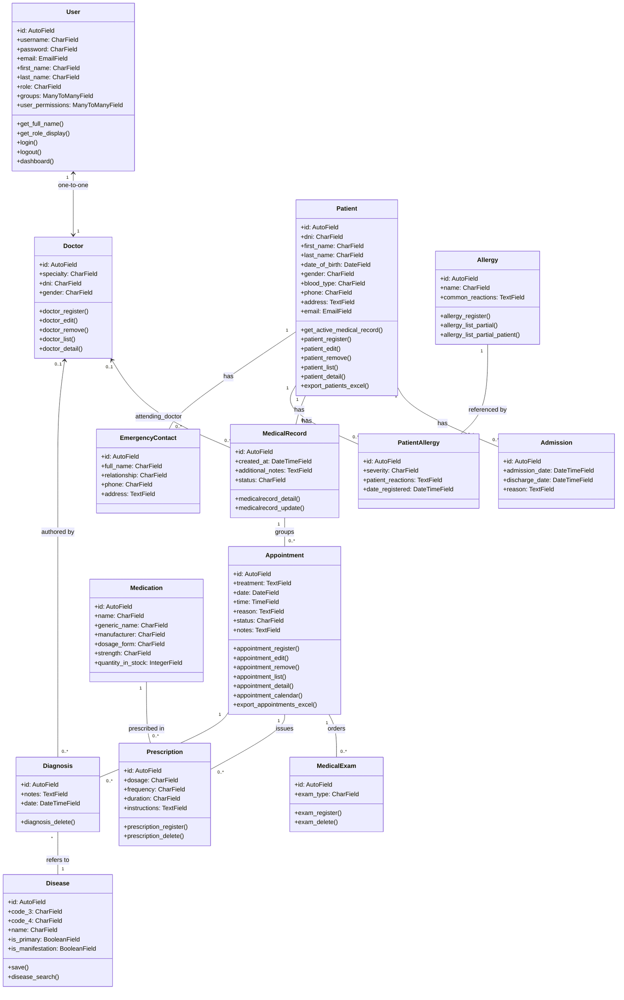

```mermaid
classDiagram
    class User {
      +id: AutoField
      +username: CharField
      +password: CharField
      +email: EmailField
      +first_name: CharField
      +last_name: CharField
      +role: CharField
      +groups: ManyToManyField
      +user_permissions: ManyToManyField
      +get_full_name()
      +get_role_display()
      +login()
      +logout()
      +dashboard()
    }
    class Doctor {
      +id: AutoField
      +specialty: CharField
      +dni: CharField
      +gender: CharField
      +doctor_register()
      +doctor_edit()
      +doctor_remove()
      +doctor_list()
      +doctor_detail()
    }
    class Patient {
      +id: AutoField
      +dni: CharField
      +first_name: CharField
      +last_name: CharField
      +date_of_birth: DateField
      +gender: CharField
      +blood_type: CharField
      +phone: CharField
      +address: TextField
      +email: EmailField
      +get_active_medical_record()
      +patient_register()
      +patient_edit()
      +patient_remove()
      +patient_list()
      +patient_detail()
      +export_patients_excel()
    }
    class EmergencyContact {
      +id: AutoField
      +full_name: CharField
      +relationship: CharField
      +phone: CharField
      +address: TextField
    }
    class Allergy {
      +id: AutoField
      +name: CharField
      +common_reactions: TextField
      +allergy_register()
      +allergy_list_partial()
      +allergy_list_partial_patient()
    }
    class PatientAllergy {
      +id: AutoField
      +severity: CharField
      +patient_reactions: TextField
      +date_registered: DateTimeField
    }
    class Disease {
      +id: AutoField
      +code_3: CharField
      +code_4: CharField
      +name: CharField
      +is_primary: BooleanField
      +is_manifestation: BooleanField
      +save()
      +disease_search()
    }
    class Diagnosis {
      +id: AutoField
      +notes: TextField
      +date: DateTimeField
      +diagnosis_delete()
    }
    class MedicalRecord {
      +id: AutoField
      +created_at: DateTimeField
      +additional_notes: TextField
      +status: CharField
      +medicalrecord_detail()
      +medicalrecord_update()
    }
    class Appointment {
      +id: AutoField
      +treatment: TextField
      +date: DateField
      +time: TimeField
      +reason: TextField
      +status: CharField
      +notes: TextField
      +appointment_register()
      +appointment_edit()
      +appointment_remove()
      +appointment_list()
      +appointment_detail()
      +appointment_calendar()
      +export_appointments_excel()
    }
    class Medication {
      +id: AutoField
      +name: CharField
      +generic_name: CharField
      +manufacturer: CharField
      +dosage_form: CharField
      +strength: CharField
      +quantity_in_stock: IntegerField
    }
    class Prescription {
      +id: AutoField
      +dosage: CharField
      +frequency: CharField
      +duration: CharField
      +instructions: TextField
      +prescription_register()
      +prescription_delete()
    }
    class MedicalExam {
      +id: AutoField
      +exam_type: CharField
      +exam_register()
      +exam_delete()
    }
    class Admission {
      +id: AutoField
      +admission_date: DateTimeField
      +discharge_date: DateTimeField
      +reason: TextField
    }
    %% Relaciones (igual que antes)
    User "1" <--> "1" Doctor : one-to-one
    Patient "1" -- "0..*" EmergencyContact : has
    Patient "1" -- "0..*" PatientAllergy : has
    Allergy "1" -- "0..*" PatientAllergy : referenced by
    Appointment "1" -- "0..*" Diagnosis : includes
    Diagnosis "*" -- "1" Disease : refers to
    Doctor "0..1" <-- "0..*" Diagnosis : authored by
    Patient "1" -- "0..*" MedicalRecord : has
    Doctor "0..1" <-- "0..*" MedicalRecord : attending_doctor
    MedicalRecord "1" -- "0..*" Appointment : groups
    Appointment "1" -- "0..*" Prescription : issues
    Medication "1" -- "0..*" Prescription : prescribed in
    Appointment "1" -- "0..*" MedicalExam : orders
    Patient "1" -- "0..*" Admission : has
```