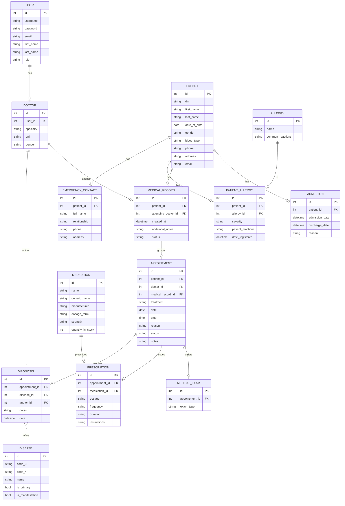

```mermaid
erDiagram
    USER {
        int id PK
        string username
        string password
        string email
        string first_name
        string last_name
        string role
    }
    DOCTOR {
        int id PK
        int user_id FK
        string specialty
        string dni
        string gender
    }
    PATIENT {
        int id PK
        string dni
        string first_name
        string last_name
        date date_of_birth
        string gender
        string blood_type
        string phone
        string address
        string email
    }
    EMERGENCY_CONTACT {
        int id PK
        int patient_id FK
        string full_name
        string relationship
        string phone
        string address
    }
    ALLERGY {
        int id PK
        string name
        string common_reactions
    }
    PATIENT_ALLERGY {
        int id PK
        int patient_id FK
        int allergy_id FK
        string severity
        string patient_reactions
        datetime date_registered
    }
    DISEASE {
        int id PK
        string code_3
        string code_4
        string name
        bool is_primary
        bool is_manifestation
    }
    DIAGNOSIS {
        int id PK
        int appointment_id FK
        int disease_id FK
        int author_id FK
        string notes
        datetime date
    }
    MEDICAL_RECORD {
        int id PK
        int patient_id FK
        int attending_doctor_id FK
        datetime created_at
        string additional_notes
        string status
    }
    APPOINTMENT {
        int id PK
        int patient_id FK
        int doctor_id FK
        int medical_record_id FK
        string treatment
        date date
        time time
        string reason
        string status
        string notes
    }
    MEDICATION {
        int id PK
        string name
        string generic_name
        string manufacturer
        string dosage_form
        string strength
        int quantity_in_stock
    }
    PRESCRIPTION {
        int id PK
        int appointment_id FK
        int medication_id FK
        string dosage
        string frequency
        string duration
        string instructions
    }
    MEDICAL_EXAM {
        int id PK
        int appointment_id FK
        string exam_type
    }
    ADMISSION {
        int id PK
        int patient_id FK
        datetime admission_date
        datetime discharge_date
        string reason
    }

    USER ||--o| DOCTOR : "has"
    PATIENT ||--o| EMERGENCY_CONTACT : "has"
    PATIENT ||--o| PATIENT_ALLERGY : "has"
    ALLERGY ||--o| PATIENT_ALLERGY : "is"
    APPOINTMENT ||--o| DIAGNOSIS : "includes"
    DIAGNOSIS }o--|| DISEASE : "refers"
    DOCTOR ||--o| DIAGNOSIS : "author"
    PATIENT ||--o| MEDICAL_RECORD : "has"
    DOCTOR ||--o| MEDICAL_RECORD : "attends"
    MEDICAL_RECORD ||--o| APPOINTMENT : "groups"
    APPOINTMENT ||--o| PRESCRIPTION : "issues"
    MEDICATION ||--o| PRESCRIPTION : "prescribed"
    APPOINTMENT ||--o| MEDICAL_EXAM : "orders"
    PATIENT ||--o| ADMISSION : "has"
```